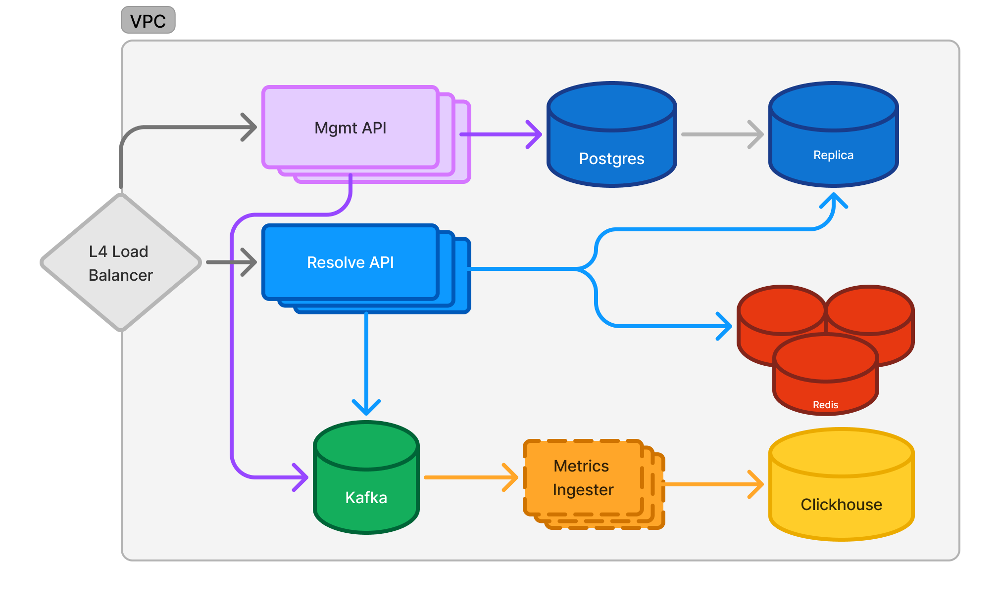

# Documento de diseño

## Introducción
Se requiere hacer un urlshortener tipo goo.gl o bitly para publicar promociones en twitter.

# Requisitos
Armar la arquitectura de la solución de modo que satisfaga los siguientes requisitos:
- Las urls tienen una vigencia indefinida.
- La plataforma debe soportar picos de tráfico alrededor de 1M RPM.
- Debemos contar con estadísticas de acceso nearly real time.
- Las URLs publicadas deben poder ser administradas:
    - Habilitarse o deshabilitarse
    - Modificar la url de destino
- A su vez la resolución de urls debe realizarse lo más rápido y con el menor costo
posible.
- La funcionalidad debe ser operativa en un 99,98% del tiempo (uptime)

## Propuesta

A continuación propongo una aproximación iterativa a la construcción del sistema.

> Nota: Servicios como autorización y autenticación, rate-limiting, métricas de sistema (e.g OTEL), alerting, etc. son omitidos y se asumen.

> Esta propuesta habla de los componentes del sistema, mas no de la plataforma. Si una organización tiene ya una infraestructura establecida de, por ejemplo, Kubernetes, los componentes descritos aquí podrían ser desplegados allí. De lo contrario, también se desplegar utilizando máquinas virtuales "dedicadas" y servicios ofrecidos por la nube de elección (p. ej. RDS en AWS, CloudSQL en GCP, etc.).



Esta arquitectura busca atender los requisitos, pero también ser _future proof_.

Empezando por los servicios HTTP, durante el desarrollo de la prueba de concepto me percaté de que en realidad hay 2 APIs: una de gestión de URLs (`/url`) y una de resolución de URLs (`/`), cada una con usuarios y cargas con comportamientos distintos. Por lo tanto, considero que tiene mucho sentido dividirla en 2 binarios, de modo que la API de resolución pueda escalar independientemente de la de gestión, que tendrá una carga menor. Desplegar ambos APIs con instancias redundantes garantizará que el sistema se mantenga usable incluso después de que alguna falle. Por otro lado, es recomendable desplegar cada instancia en _Availability Zones_ distintos, y dependiendo de la carga y la geolocaclización de los usuarios, en regiones distintas.

Como consecuencia, en la capa de persistencia se tiene una instancia principal de Postgres, para ser usada por el API de gestión, y una réplica de lectura donde el API de resolución podrá consultar URLs que no encuentre en la caché. Esta configuración de la base de datos también significa que en caso de haber una falla en la instancia principal, la réplica de lecutra puede ser "ascendida", minimizando el tiempo de indisponibilidad del sistema.

Un cluster de Redis se encarga de mantener en memoria las URLs consultadas más recientemente. Asumiendo una longitud promedio de 75B para las URLs almacenadas, mas un _key_ el ("hash" usado para identificar URLs) de 5B, tendríamos que una tupla key:url ocupa ~80B. Por lo tanto, en 1GiB de memoria de cache podrían caber aproximadamente 13'421772 tuplas. Dado que las URLs son de duración indefinida, se puede configurar un TTL para eliminar aquellas que no hayan sido accedidas recientemente.

El almacenamiento de métricas se hace en Clickhouse, que es en este momento el estado del arte para _workloads_ de analítica, capaz de ejecutar queries sobre cientos de millones de filas. La ingestión de los eventos de métricas se hace por medio de un cluster de Kafka o Redpanda, o incluso simplemente RabbitMQ. Asumamos un evento de métricas por visitar una URL con esta estructura:
```json
{"url_key": "o9g6", "timestamp_utc": "1734528284", "location": "Medellín, Colombia"}
```
Si lo codificamos con protobuf, tendría aproximadamente 32B. Durante un pico de 1M RPM, las instancias del API de resolución emitirían 1 millon de mensajes así, por minuto, lo cuál sería apenas 32MB. Si se considera que el sistema se mantendrá en una carga menor o igual a esta, se podrían evaluar otras alternativas.

La conexión entre Clickhouse y el sistema de eventos elegido se puede hacer con un middleware sencillo.

### Prueba de concepto

Según mis pruebas durante la prueba de concepto, el servidor en [`/src`](src), ejecutándose en una máquina EC2 m5.large, con una instancia propia de Redis puede sostener cargas de ~9400 RPS en el happy path (cache hit), con latencias p99 por debajo de los 10ms (estando en la misma red) ([resultados](static/ab_result_happy.md)) y cargas máximas de ~4000 RPS para requests que van hasta la DB (db.t3.medium), con latencias p99 menores a 30ms ([resultados](static/ab_result_sad.md)). Ambos _paths_ tienen latencias de cola máximas de ~1.07s.

Por esto, solo se necesitarían 3 instancias del servicio con la misma infraestructura + caché para sostener picos de 1M RPM. En máquinas con un número mayor de vCPUs se podría ver un aumento en los RPS máximos. Por otro lado, una instancia más potente de la DB podría ayudar a aumentar los RPS máximos en el sad path.

## Evaluación de alternativas

### Postgres

- Cockroach DB podría ayudar si se proyectara un volumen de datos alto, tal que significara la posibilidad de escalar una DB Postgres verticalmente constantemente, o implementar un esquema de _sharding_ externo. Por el diseño de Cockroach, en lugar de hacer eso se podría escalar la DB horizontalmente, que _normalmente_ es más sencillo dado que Cockroach lo soporta nativamente.
- Otras DBs SQL: Personalmente no tengo experiencia con otras DBs SQL (p. ej. MySQL), lo cual siento que es en parte por la cantidad de herramientas y soporte con las que cuenta Postgres.
- NoSQL columnares como Cassandra, Dynamo, Scylla: Usualmente soportan una gran carga de escritura, pero eso no es un requisito determinante en este sistema.

### Redis

- Existen alternativas a Redis como Elasticache o Dragonfly, pero son en general equivalentes.
- [Sieve](https://cachemon.github.io/SIEVE-website/) podría ser una alternativa interesante para embeber la caché en el API de resolución. Eliminaría el componente desplegable extra (Redis), y como algoritmo está diseñado para funcionar de manera distribuída.

### Clickhouse

- Redshift y BigQuery han sido hasta el momento los nombres más reconocidos para sistemas OLAP. El consenso parece ser que BigQuery es muy lento para estándares modernos, y ClickHouse requiere de más trabajo para optimizar las consultas. Sin embargo, cuando se consigue hacerlo, los tiempos de respuesta son varias veces mejores. Ver [este blogpost de PostHog](https://posthog.com/blog/clickhouse-vs-redshift), por ejemplo. En este caso, como el requisito es near-real time, ClickHouse or Redshift son las alternativas más fuertes.

- Postgres: Se ha demostrado que con técnicas relativamente simples, como indexación y [particionamiento](https://www.crunchydata.com/blog/building-customer-facing-real-time-dashboards-with-postgres) se pueden alcanzar muy buenos resultados. Sin embargo, Clickhouse y otras bases de datos OLAP están diseñada para este tipo de casos de uso, así que es mejor ir a lo seguro.